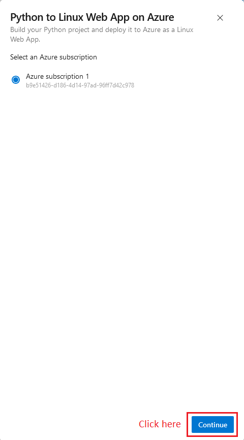

# Overview  
[](https://github.com/nq-datxx/udacity-flash-ml-service/actions/workflows/main.yml)  
In this project, we will build a Flask machine learning application that predict the housing price base on provided model. We will also implementing **Continuous Intergration (CI)** and **Continuous Delivery (CD)** using:

* Github Action (for CI)
* Azure pipelines (for CD)

# Architectural Diagram  


## Project Plan

* [Trello board](https://trello.com/b/ezceARSX/udacity-flask-ml-application)
* [Original Project plan](https://docs.google.com/spreadsheets/d/14Pw9gB6uZwTd-Gzfv0MFv9Odp1oDmBMK/edit?usp=sharing&ouid=105057463312095980141&rtpof=true&sd=true)
* [Final Project plan](https://docs.google.com/spreadsheets/d/1ajLfwmC7_aCg59WHVYKdEA2thd8dyiul/edit?usp=sharing&ouid=105057463312095980141&rtpof=true&sd=true)

## Prerequisite:
* Azure account
* Github account
* Internet connection

## Instructions
### 1. Setup Azure Cloud shell


### 2. Add SSH key to Github
* Run command below on **Azure Cloud shell** to generate SSH keys
    ```shell
    ssh-keygen -t rsa
    ```
    

* Use command below to show key content and add it to your Github account
    ```shell
    cat /home/<yournamehere>/.ssh/id_rsa.pub
    ```
    
    

### 3. Continuous Integrate on Github
* Clone resource [here](https://github.com/udacity/nd082-Azure-Cloud-DevOps-Starter-Code/tree/master/C2-AgileDevelopmentwithAzure/project/starter_files/flask-sklearn) to your github account

* Clone project into Azure Cloud Shell.  
    
    

#### Test run on Azure cloud shell (Optional)
* On your Azure cloud shell, locate to your resource folder and run command below to create virtual environment.
    ```shell
    python -m venv venv
    source venv/bin/activate
    ```

* Run file **Makefile** by command `make all`

* Passing tests that are displayed after running the `make all` command from the `Makefile`.
    

* Test run the source code on Azure cloud shell by running command below.
    ```shell
    export FLASK_APP=app.py
    flask apps
    ```
* Output of a test run.  
    
* Open new session o Azure cloud shell and call file `make_prediction.sh` to test if the web app response correctly.
    

### 4. Deploy application to Azure web app service
* Create a file name `command.sh` at add code below to the file and save
    ```bash
    #!/usr/bin/env bash
    resourceGroup="<your-resource-group-name>"
    location="westus"
    appservice="<your-app-service-name>"

    pythonVersion="3.11"

    echo "Creating resource group..."
    az group create -n $resourceGroup -l $location

    echo "Upload source to $appservice"
    az webapp up -n $appservice -g $resourceGroup --runtime "PYTHON:$pythonVersion" --sku F1 -l $location

    echo "Verify app service"
    az webapp show --name $appservice --resource-group $resourceGroup
    ```

* Using command below to execute `command.sh` to upload and build your web app on Azure.
    ```bash
    source command.sh
    ```

* Project running on Azure App Service.  
    
    

### 5. Continuous Delivery on Azure
* Search "*Azure Devops Organization*"
    
    
* Here you can create new or choose he already existed organization   
    
    
    
    
    
    
    
* Choose your webapp service that already deployed and click "Validate and configure"  
    
* Press "Save and run"  
    
* Successful deploy of the project in Azure Pipelines.
    

* Successful prediction from deployed flask app in Azure Cloud Shell.
    

* Output of streamed log files from deployed application.
    

## Enhancements
- Should Add Azure app insight for alerts and performance monitor

## Demo 
Link to Demo video: [Youtube](https://youtu.be/DpdJV3nRFjs)